# Diagrama de Procesos del Sistema de Gestión de Minerales

## 🏭 Flujo General del Sistema

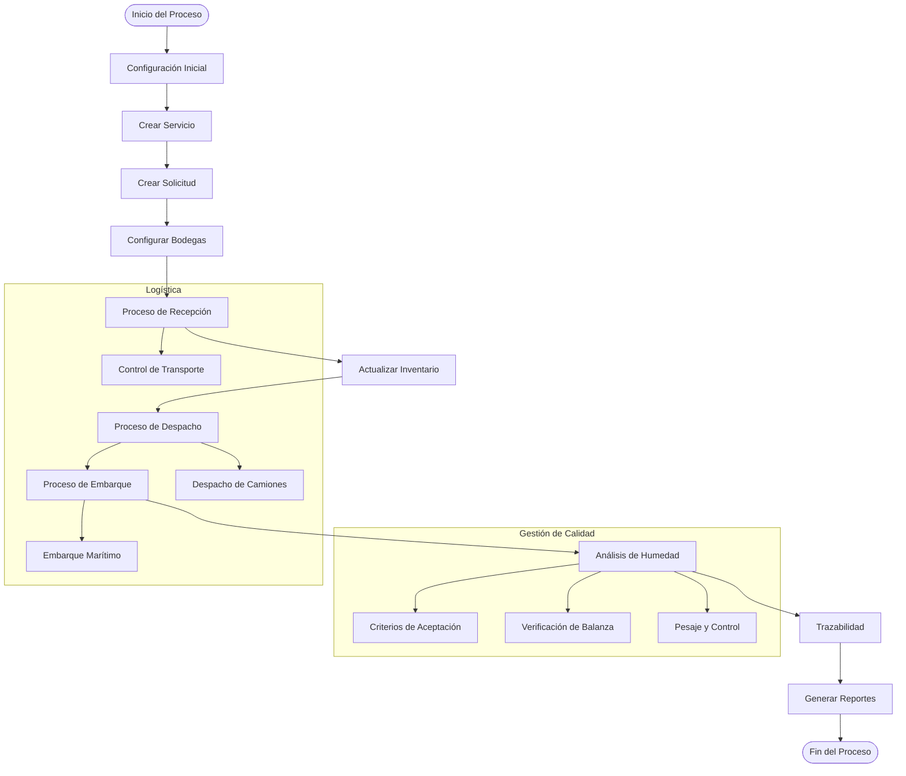

## 📋 Proceso Detallado por Módulos

### 1. **Gestión de Servicios**
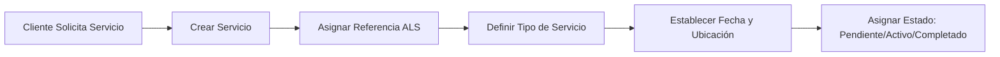

### 2. **Gestión de Solicitudes**
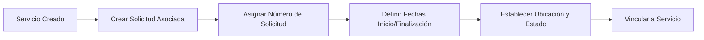

### 3. **Configuración de Bodegas**
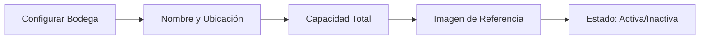

### 4. **Proceso de Recepción**
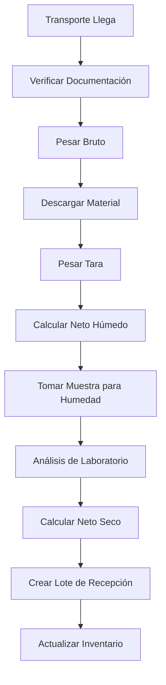

### 5. **Gestión de Inventario**
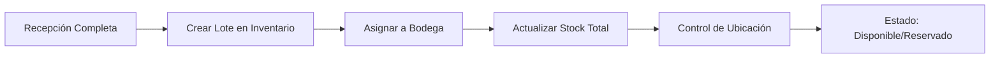

### 6. **Proceso de Despacho**

### 7. **Proceso de Embarque**
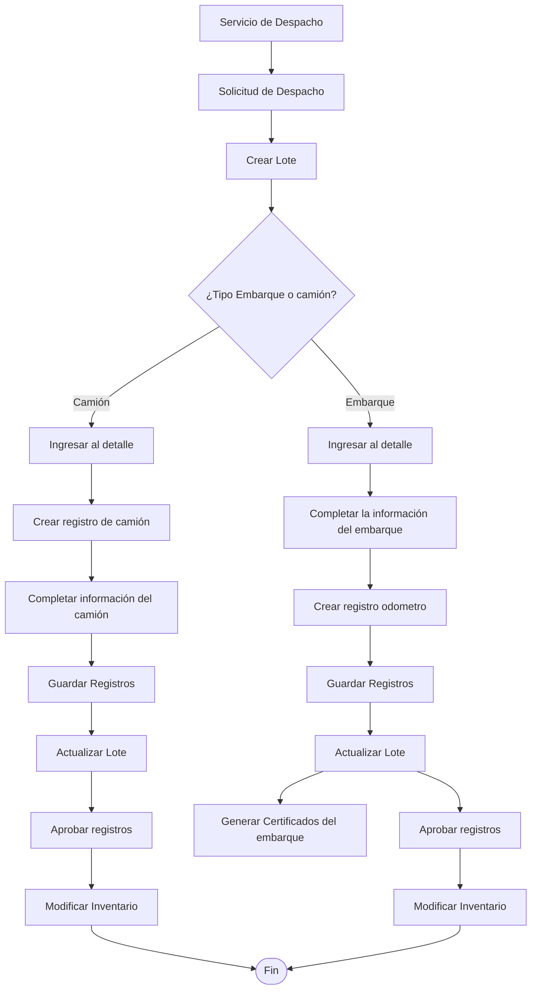

### 8. **Análisis de Humedad**
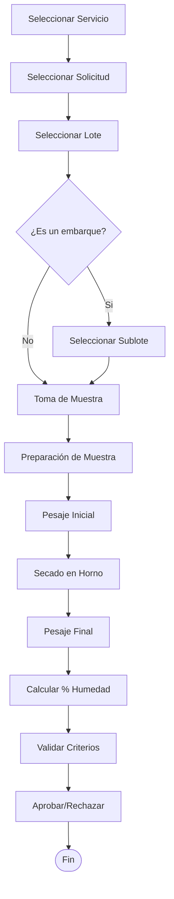

### 9. **Trazabilidad**
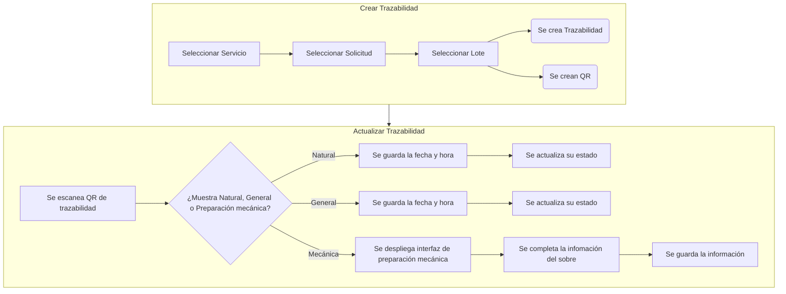

### 10. **Generación de Reportes**
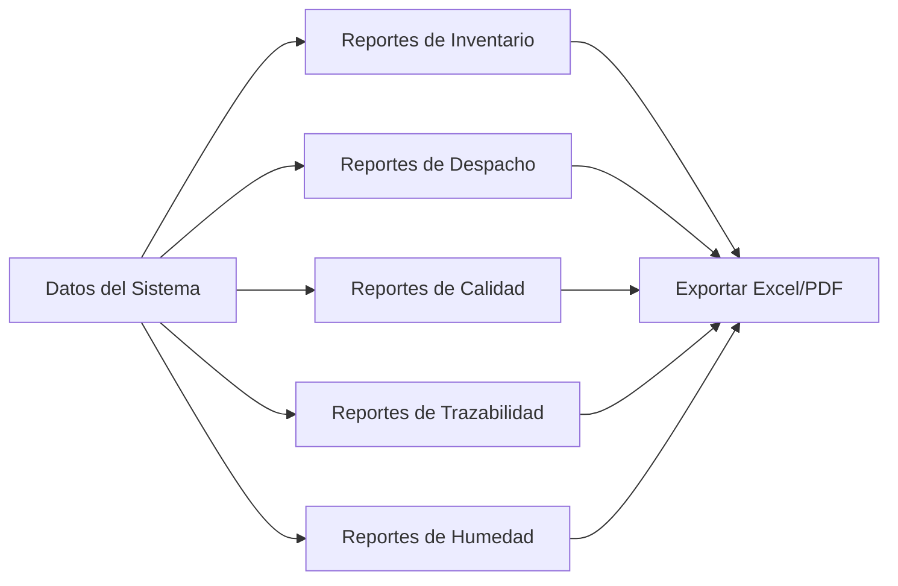

## 🔍 Estados del Sistema

### Estados de Servicio
- **Pendiente**: Servicio creado, pendiente de inicio
- **Activo**: Servicio en proceso
- **Completado**: Servicio finalizado
- **Cancelado**: Servicio anulado

### Estados de Lotes
- **Recepción**: Lote en proceso de recepción
- **Inventario**: Lote disponible en bodega
- **Reservado**: Lote asignado para despacho
- **Despachado**: Lote enviado
- **Embarcado**: Lote en embarque final

### Estados de Transporte
- **En tránsito**: Transporte en movimiento
- **En destino**: Transporte llegó a destino
- **Descargado**: Material descargado
- **Cargado**: Material cargado para despacho

## 📊 Integración de Sistemas

### Frontend (Angular)
- **Páginas**: Recepción, Despacho, Inventario, Humedad, Trazabilidad, Reportes
- **Servicios**: HTTP Client para comunicación con API
- **Estado**: Gestión en tiempo real

### Backend (Django REST Framework)
- **API Endpoints**: CRUD para todos los módulos
- **Serializers**: Transformación de datos
- **Autenticación**: Control de acceso por roles
- **Base de Datos**: SQLite3 con modelos relacionales

### Flujo de Datos
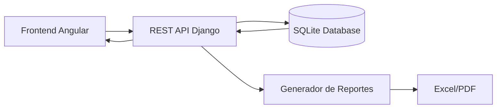

## 🔄 Procesos Automatizados

### Cálculos Automáticos
- **Neto Seco**: Basado en % de humedad
- **Diferencias**: Entre origen y destino
- **Totales**: Inventario por bodega
- **Trazabilidad**: Códigos QR automáticos

### Notificaciones
- **Alertas**: Vencimiento de fechas
- **Estados**: Cambios en lotes
- **Reportes**: Generación programada

## 📱 Acceso Móvil y Web

### Diseño Responsivo
- **Desktop**: Acceso completo a todas funciones
- **Tablet**: Funcionalidad básica
- **Móvil**: Consulta de información y escaneo QR

### Integración con Hardware
- **Balanza**: Lectura automática de pesos
- **Escáner**: Código QR para trazabilidad
- **Impresora**: Etiquetas y reportes

---

## 🎯 Resumen de Procesos Clave

1. **Inicio**: Cliente solicita servicio → Sistema crea servicio y solicitud
2. **Recepción**: Transporte llega → Se recepciona → Se analiza → Se almacena
3. **Inventario**: Control de stock → Ubicación en bodega → Estado disponible
4. **Despacho**: Solicitud → Selección de lotes → Despacho → Actualización
5. **Embarque**: Finalización → Documentación → Envío al cliente
6. **Trazabilidad**: Seguimiento completo desde origen hasta destino final
7. **Reportes**: Generación automática de todos los indicadores del sistema
